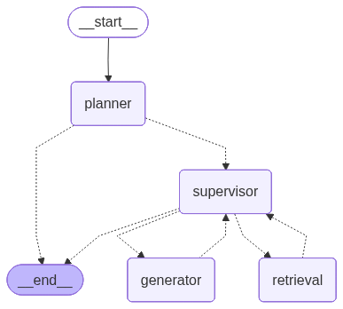
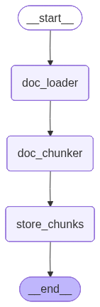

# Finance Agentic RAG Chatbot

An agentic Retrieval-Augmented Generation (RAG) chatbot for financial and investment analysis.

Built with **FastAPI**, **LangChain**, and **LangGraph**, it leverages **OpenAI**, **Redis**, **Qdrant**, and custom MCP servers (such as yfinance and Tavily Search) for multi-step reasoning, tool use, and document retrieval.

---

## Table of Contents

- [Workflow Overview](#workflow-overview)
- [Architecture](#architecture)
- [Installation](#installation)
- [Setup](#setup)
- [Environment Variables](#environment-variables)
- [Running Vector Store and Redis](#running-vector-store-and-redis)
- [MCP Servers](#mcp-servers-yfinance-tavily-search)
- [Running the Application](#running-the-application)
- [API Usage](#api-usage)
- [Testing](#testing)
---

## Workflow Overview

### 1. Chatbot Agentic Workflow

#### **Diagram**


#### **Workflow Nodes**

| Node        | Description                                                                                                   |
|-------------|--------------------------------------------------------------------------------------------------------------|
| **planner**     | Analyzes the user's query and generates a step-by-step plan, determining required tools or retrieval actions. If a cached is hit in the semantic cache, the planner will directly terminate the workflow by returning the cached response. |
| **supervisor**  | Dynamically routes the workflow by deciding the next node to execute based on the current state and plan.     |
| **retrieval**   | Retrieves relevant documents from the vector store (**Qdrant**) as per the user's query or plan.              |
| **generator**   | Produces the final response by combining LLM reasoning, tool outputs, and retrieved documents.                |
| **end**         | Terminates the workflow and delivers the final response to the user.                                         |

#### **Key Features**
- **Autonomous Planning:** The LLM plans and executes multi-step actions.
- **Dynamic Routing:** Workflow adapts based on intermediate results.
- **Integrated Retrieval:** Combines tool outputs and document search for comprehensive answers.

---

### 2. Document Ingestion Workflow

#### **Diagram**


#### **Pipeline Steps**

| Step           | Description                                                                                       |
|----------------|--------------------------------------------------------------------------------------------------|
| **doc_loader**     | Loads raw documents (PDF, DOCX, HTML, TXT) and extracts their content.                           |
| **doc_chunker**    | Splits loaded documents into smaller, manageable chunks for efficient embedding and retrieval.     |
| **store_chunks**   | Embeds the chunked documents and stores them in the Qdrant vector database for semantic search.    |
| **end**            | Marks the completion of the ingestion process.                                                    |

#### **Key Features**
- **Efficient Indexing:** Ensures all documents are chunked and embedded for fast retrieval.
- **Semantic Search Ready:** All ingested content is available for high-quality retrieval-augmented generation.

---

## Architecture

- **FastAPI**: REST API for chat, ingestion, and health endpoints.
- **LangChain & LangGraph**: Agentic workflow orchestration and prompt management.
- **OpenAI**: LLM and embedding provider (Azure OpenAI supported).
- **MCP Servers**:
    - **yfinance**: Tools for extracting financial data.
    - **Tavily Search**: Web search tools.
- **Qdrant**: Vector database for document embeddings and retrieval.
- **Redis**: Semantic cache.
- **PostgreSQL** (Optional): For structured data and metadata storage.

---

## Installation

1. Clone the repository:
     ```bash
     git clone https://github.com/your-org/agentic-rag-chatbot.git
     cd agentic-rag-chatbot
     ```
2. Install dependencies (using [Poetry](https://python-poetry.org/)):
     ```bash
     poetry install
     ```

---

## Setup

### Environment Variables

Before running the application, ensure you have set the following environment variables in your `.env` file:

```env
# Azure Chat OpenAI Configuration
AZURE_OPENAI_API_KEY=
AZURE_OPENAI_ENDPOINT=
AZURE_OPENAI_DEPLOYMENT=
AZURE_OPENAI_API_VERSION=

# Azure Embedding Configuration
AZURE_OPENAI_EMBEDDING_DEPLOYMENT=
AZURE_OPENAI_EMBEDDING_API_VERSION=

# Tavily Search
TAVILY_API_KEY=

# Redis
REDIS_URL=

# Vector Database
QDRANT_URL=
QDRANT_API_KEY=
```

> **Note:** All variables are required for full functionality. Update the values according to your cloud and service credentials before starting the application.

---

## Running Vector Store and Redis

You need two core services: a vector store (e.g., Qdrant) and Redis. Below are setup options for each.

###  Redis

#### **Option A: Run Redis with Docker**

```bash
docker run -d --name redis -p 6379:6379 redis:latest
```
- Pulls the latest Redis image (if not present).
- Starts Redis in detached mode.
- Maps container port `6379` to the host.

#### **Option B: Install Redis on Linux (Debian/Ubuntu)**

```bash
sudo apt-get install lsb-release curl gpg
curl -fsSL https://packages.redis.io/gpg | sudo gpg --dearmor -o /usr/share/keyrings/redis-archive-keyring.gpg
echo "deb [signed-by=/usr/share/keyrings/redis-archive-keyring.gpg] https://packages.redis.io/deb $(lsb_release -cs) main" | sudo tee /etc/apt/sources.list.d/redis.list
sudo apt-get update
sudo apt-get install redis
```

Start and enable Redis:

```bash
sudo systemctl enable redis-server
sudo systemctl start redis-server
```

Check if Redis is running:

```bash
redis-cli ping
# Should return "PONG"
```

> For other distributions and detailed instructions, see the [official Redis installation docs](https://redis.io/docs/install/).

---

### Qdrant (Vector Store)

You will need a Qdrant instance or cluster. There are two main options:

#### **Option A: Qdrant Cloud**

- Create a cluster via [Qdrant Cloud](https://cloud.qdrant.io/) (free tier and self-managed options available).

#### **Option B: Self-Hosted Qdrant**

- Follow the [Qdrant documentation](https://qdrant.tech/documentation/) for deployment, configuration, and scaling.
- Qdrant supports sharding, replicas, and cluster rebalancing for distributed deployments.

Once your Qdrant instance is running, configure your application to connect using the appropriate host, port, API key, and collection settings.

---

## MCP Servers (yfinance, Tavily Search)

- **yfinance MCP**: https://github.com/jl0703/yfinance-mcp
- **Tavily Search MCP**: https://github.com/tavily-ai/tavily-mcp

Configure the endpoints for these MCP servers in config files so the chatbot can access them.

---

## Running the Application

- **With Poetry**:
    ```bash
    poetry run uvicorn app.main:app --reload
    ```
- **With Docker**:
    ```bash
    docker build -t agentic-rag-chatbot .
    docker run --env-file .env -p 8000:8000 agentic-rag-chatbot
    ```

---

## API Usage

- **FastAPI docs**: [http://localhost:8000/docs](http://localhost:8000/docs)
- **Chat endpoint**: `/chat/` (POST: `user_id`, `message`)
- **Streaming chat**: `/chat/stream`
- **Document ingestion**: `/ingestion/upload`
- **Health checks**: `/health/openai`, `/health/redis`, `/health/qdrant`, `/health/mcp`

---

## Testing

Run all tests with:

```bash
pytest
```
